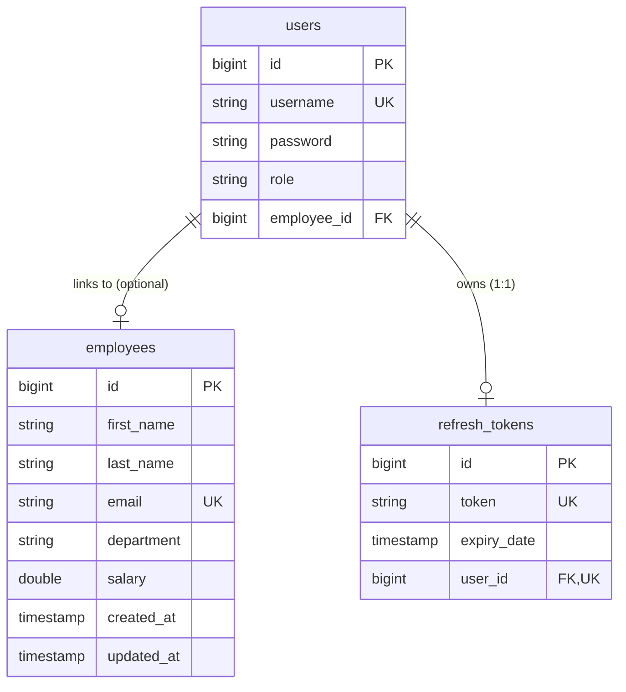

# 🏢 Employee Management System — Comprehensive Technical Documentation

---

## 📑 Table of Contents
1. [Executive Summary & System Architecture](#1-executive-summary--system-architecture)
2. [Technology Stack](#2-technology-stack)
3. [Database Design & Data Models](#3-database-design--data-models)
4. [Security Architecture & Authentication](#4-security-architecture--authentication)
5. [Backend Architecture & Business Logic](#5-backend-architecture--business-logic)
6. [REST API Specification](#6-rest-api-specification)
7. [Frontend Architecture & UI Design System](#7-frontend-architecture--ui-design-system)
8. [DevOps & Single-Artifact Deployment](#8-devops--single-artifact-deployment)
9. [Testing & Quality Assurance](#9-testing--quality-assurance)
10. [Local Development & Troubleshooting](#10-local-development--troubleshooting)

---

## 1. Executive Summary & System Architecture

The **Employee Management System (EMS)** is an enterprise-grade, full-stack web application designed for managing workforce operations, tracking organizational analytics, and enforcing fine-grained, role-based security.

### System Architecture Diagram

```
+-----------------------------------------------------------------------------------+
|                                 CLIENT BROWSER                                    |
|                                                                                   |
|  +-----------------------------------------------------------------------------+  |
|  |                      React 19 SPA (Vite + Tailwind CSS v4)                  |  |
|  |  [Dashboard] [Employees] [Departments] [Reports] [Profile] [Settings]       |  |
|  +-------------------------------------+---------------------------------------+  |
+----------------------------------------|------------------------------------------+
                                         | HTTP / REST (JWT Bearer Token)
                                         v
+-----------------------------------------------------------------------------------+
|                        SPRING BOOT 3.5.3 (JAVA 21 RUNTIME)                       |
|                                                                                   |
|  +-----------------------------------------------------------------------------+  |
|  |                       Spring MVC Web Layer / SPA Forwarder                  |  |
|  |                       (Serves index.html for non-API routes)                |  |
|  +-------------------------------------+---------------------------------------+  |
|                                        |                                          |
|  +-------------------------------------v---------------------------------------+  |
|  |                       Spring Security 6 (Stateless)                         |  |
|  |  [JwtFilter]  --->  [SecurityConfig]  --->  [Method Security (@PreAuthorize)]  |  |
|  +-------------------------------------+---------------------------------------+  |
|                                        |                                          |
|  +-------------------------------------v---------------------------------------+  |
|  |                        Controllers & Service Layer                          |  |
|  |  - AuthController  <-->  AuthService  <-->  RefreshTokenService             |  |
|  |  - EmployeeController <--> EmployeeService                                   |  |
|  +-------------------------------------+---------------------------------------+  |
|                                        |                                          |
|  +-------------------------------------v---------------------------------------+  |
|  |                        Spring Data JPA / Hibernate                          |  |
|  |  - UserRepository  |  EmployeeRepository  |  RefreshTokenRepository         |  |
|  +-------------------------------------+---------------------------------------+  |
+----------------------------------------|------------------------------------------+
                                         | JDBC (HikariCP)
                                         v
+-----------------------------------------------------------------------------------+
|                            POSTGRESQL DATABASE (NEON)                             |
|                                                                                   |
|  Tables: `users`  |  `employees`  |  `refresh_tokens`                            |
+-----------------------------------------------------------------------------------+
```

---

## 2. Technology Stack

### Backend Infrastructure
| Component | Technology | Version | Purpose |
|---|---|---|---|
| **Language** | Java | 21 | High-performance, modern LTS Java runtime |
| **Framework** | Spring Boot | 3.5.3 | Core application framework & IoC container |
| **Security** | Spring Security | 6.5.1 | Authentication, authorization, & filter chain |
| **Persistence** | Spring Data JPA / Hibernate | 6.6.18 | ORM mapping and data repository layer |
| **Database** | PostgreSQL | 16 (Neon Serverless) | Production relational database engine |
| **Tokens** | JJWT | 0.12.6 | HMAC-SHA256 JWT generation and validation |
| **API Docs** | Springdoc OpenAPI | 2.8.6 | Swagger UI integration (`/swagger-ui.html`) |

### Frontend Infrastructure
| Component | Technology | Version | Purpose |
|---|---|---|---|
| **Library** | React | 19.0.0 | Component-based UI library |
| **Build Tool** | Vite | 8.1.5 | Fast development server & production bundler |
| **Styling** | Tailwind CSS | 4.0 | Utility-first styling & custom design tokens |
| **Routing** | React Router | 7.x | Client-side SPA navigation |
| **HTTP Client**| Axios | 1.x | Async API calls with JWT request/response interceptors |
| **Charts** | Recharts | 2.x | Responsive data visualizations (Pie, Bar, Area charts) |
| **Icons** | React Icons | 5.x | Heroicons (`HiOutline*`) interface icons |

---

## 3. Database Design & Data Models

The database consists of 3 relational tables mapped via JPA Entities:



### Data Dictionary

#### 1. Entity: `User` (`users` table)
- `id` (`Long`, Primary Key, Auto-Increment)
- `username` (`String`, Unique, Not Null) — Credentials for authentication
- `password` (`String`, Not Null) — BCrypt hashed password
- `role` (`Role` Enum, Not Null) — `ADMIN` or `EMPLOYEE`
- `employeeId` (`Long`, Nullable) — FK linking an `EMPLOYEE` user to their profile record in `employees`

#### 2. Entity: `Employee` (`employees` table)
- `id` (`Long`, Primary Key, Auto-Increment)
- `firstName` (`String`, Not Null)
- `lastName` (`String`, Not Null)
- `email` (`String`, Unique, Not Null)
- `department` (`String`, Not Null)
- `salary` (`Double`, Not Null)
- `createdAt` (`LocalDateTime`, Updatable = false) — Set automatically via `@PrePersist`
- `updatedAt` (`LocalDateTime`) — Updated automatically via `@PreUpdate`

#### 3. Entity: `RefreshToken` (`refresh_tokens` table)
- `id` (`Long`, Primary Key, Auto-Increment)
- `token` (`String`, Unique, Not Null) — UUID string
- `expiryDate` (`Instant`, Not Null) — Expiration timestamp
- `user` (`User`, One-to-One, Foreign Key `user_id`, Unique)

---

## 4. Security Architecture & Authentication

### 1. Authentication Lifecycle

```
[Client] ---> POST /api/auth/login { username, password }
   |
   +---> AuthenticationManager.authenticate() ---> BCrypt check
   |
   +---> Generate JWT Access Token (Expiration: 24h)
   +---> Create/Flush Refresh Token in DB (Expiration: 7 days)
   |
[Client] <--- Returns AuthResponse { token, refreshToken, username, role }
```

### 2. Request Security Authorization
Every incoming HTTP request passes through `JwtFilter`:
1. Extracts `Authorization: Bearer <token>` header.
2. Extracts username & role claims from JWT.
3. Loads `UserDetails` and sets `UsernamePasswordAuthenticationToken` in `SecurityContextHolder`.
4. Executes method-level security `@PreAuthorize` rules:

| Route / Method | Allowed Roles | Authorization Condition |
|---|---|---|
| `POST /api/auth/*` | Public | None |
| `GET /` (Static/SPA) | Public | None |
| `GET /api/employees/` | ADMIN | `hasRole('ADMIN')` |
| `POST /api/employees/` | ADMIN | `hasRole('ADMIN')` |
| `DELETE /api/employees/{id}`| ADMIN | `hasRole('ADMIN')` |
| `GET /api/employees/{id}` | ADMIN / EMPLOYEE | `hasRole('ADMIN') or (hasRole('EMPLOYEE') and isOwner(#id))` |
| `PUT /api/employees/{id}` | ADMIN / EMPLOYEE | `hasRole('ADMIN') or (hasRole('EMPLOYEE') and isOwner(#id))` |

#### Fine-Grained Ownership Verification (`isOwner`)
```java
public boolean isOwner(Long employeeId, Authentication authentication) {
    User user = (User) authentication.getPrincipal();
    return user.getEmployeeId() != null && user.getEmployeeId().equals(employeeId);
}
```

---

## 5. Backend Architecture & Business Logic

### Key Components & Design Patterns

1. **`DataInitializer` (`CommandLineRunner`)**:
   Runs on application startup. Automatically seeds the database with a default `admin` account (`username: admin`, `password: admin123`, `role: ADMIN`) if no admin user exists.

2. **`JwtService` (Robust Key Handling)**:
   Generates and parses signed JWT tokens using HMAC-SHA256. Utilizes a SHA-256 message digest fallback to ensure any configured secret key (plain text or Base64) produces a compliant 256-bit signing key.

3. **`RefreshTokenService`**:
   Handles stateless access token renewal. Flushes existing tokens before issuing new ones to enforce the 1-to-1 user refresh token constraint without database collisions.

4. **`GlobalExceptionHandler` (`@RestControllerAdvice`)**:
   Intercepts domain and security exceptions (`ResourceNotFoundException`, `DuplicateResourceException`, `MethodArgumentNotValidException`, `AuthenticationException`) and transforms them into standardized `ErrorResponse` JSON payloads.

---

## 6. REST API Specification

### Authentication Endpoints (`/api/auth`)

#### `POST /api/auth/register`
- **Request Body**: `RegisterRequest` (`username`, `password`, `role`, `employeeId`)
- **Response**: `201 Created` — `AuthResponse` (`token`, `refreshToken`, `username`, `role`)

#### `POST /api/auth/login`
- **Request Body**: `LoginRequest` (`username`, `password`)
- **Response**: `200 OK` — `AuthResponse` (`token`, `refreshToken`, `username`, `role`)

#### `POST /api/auth/refresh-token`
- **Request Body**: `TokenRefreshRequest` (`refreshToken`)
- **Response**: `200 OK` — `TokenRefreshResponse` (`token`, `refreshToken`)

#### `POST /api/auth/logout`
- **Headers**: `Authorization: Bearer <token>`
- **Response**: `200 OK` — `{ "message": "Logged out successfully" }`

---

### Employee Endpoints (`/api/employees`)

#### `GET /api/employees/`
- **Query Params**: `pageNo` (default 0), `pageSize` (default 10), `sortBy` (default `id`), `sortDir` (default `asc`)
- **Response**: `200 OK` — `Page<EmployeeResponse>`

#### `GET /api/employees/{id}`
- **Response**: `200 OK` — `EmployeeResponse`

#### `POST /api/employees/`
- **Request Body**: `EmployeeRequest` (`firstName`, `lastName`, `email`, `department`, `salary`)
- **Response**: `201 Created` — `EmployeeResponse`

#### `PUT /api/employees/{id}`
- **Request Body**: `EmployeeRequest`
- **Response**: `200 OK` — `EmployeeResponse`

#### `DELETE /api/employees/{id}`
- **Response**: `204 No Content`

#### `GET /api/employees/search?keyword={term}`
- **Response**: `200 OK` — `Page<EmployeeResponse>` (searches across name, email, and department)

#### `GET /api/employees/department/{dept}`
- **Response**: `200 OK` — `Page<EmployeeResponse>`

#### `GET /api/employees/salary?min={min}&max={max}`
- **Response**: `200 OK` — `Page<EmployeeResponse>`

---

## 7. Frontend Architecture & UI Design System

### Design System Tokens (`index.css`)
- **Color Palette**:
  - Primary: `#2563EB` (Royal Blue)
  - Success: `#10B981` (Emerald Green)
  - Warning: `#F59E0B` (Amber)
  - Danger: `#EF4444` (Crimson)
  - Dark Sidebar: `#0F172A` to `#1E293B`
- **Visual Styles**:
  - Glassmorphism (`.glass-card`)
  - Elevated Stat Cards (`.stat-card`)
  - Modern Data Tables (`.data-table`)
  - Soft Micro-Animations (`fadeIn`, `pulse-soft`)

### UI Pages Matrix (9 Pages)
1. **Login**: Split-screen dark gradient hero with floating glow shapes and credential hints.
2. **Dashboard**: Executive summary with 4 stat cards, 2 Recharts graphs (Department Pie, Salary Bar), and recent hires table.
3. **Employees**: Data table with real-time search, department filtering, column sorting, pagination, and CSV export.
4. **Employee Details**: Profile banner, quick stat summary, and detail breakdown.
5. **Add Employee**: Validated form with real-time feedback and toast notifications.
6. **Edit Employee**: Pre-populated form for updating records.
7. **Departments**: Card grid displaying department headcounts, salary averages, and team rosters.
8. **Reports**: 4 analytics charts (Department Distribution, Salary Bands, Dept Salary Averages, Headcount Trends).
9. **Profile & Settings**: Account overview, security settings, and app options.

---

## 8. DevOps & Single-Artifact Deployment

### Single-Artifact Packaging Strategy
The application packages both the React SPA and Spring Boot API into a **single executable JAR file**:
1. Vite builds the frontend to `frontend/dist`.
2. Static assets are copied into `src/main/resources/static/`.
3. `WebConfig.java` implements a Web MVC view controller forwarder (`forward:/index.html`) so non-API paths are routed to React Router.

### Multi-Stage Dockerfile
```dockerfile
# Stage 1: Build React Frontend
FROM node:22-alpine AS frontend-build
...
RUN npm run build

# Stage 2: Build Spring Boot Executable JAR
FROM eclipse-temurin:21-jdk-alpine AS backend-build
...
COPY --from=frontend-build /app/frontend/dist/ src/main/resources/static/
RUN ./mvnw clean package -DskipTests -B

# Stage 3: Minimal Production JRE Runtime
FROM eclipse-temurin:21-jre-alpine AS production
...
ENTRYPOINT ["java", "-Xmx512m", "-jar", "app.jar"]
```

---

## 9. Testing & Quality Assurance

### Test Suite Structure (24 Tests)
- **`AuthServiceTest`**: Tests registration, duplicate username handling, login, and bad credentials.
- **`EmployeeServiceTest`**: Tests CRUD business logic, email uniqueness checks, and pagination.
- **`EmployeeControllerTest`**: Integration tests using `@WebMvcTest` and `MockMvc` for endpoints.
- **`EmployeeRepositoryTest`**: JPA data layer tests executed against an H2 in-memory database (`@DataJpaTest`).

#### Test Execution Command
```bash
$env:JAVA_HOME = "C:\Program Files\Java\jdk-21"
.\mvnw.cmd test
```

---

## 10. Local Development & Troubleshooting

### Running Locally

```bash
# 1. Clone repository
git clone https://github.com/harijothivenkatraman/Employee_Management.git
cd Employee_Management

# 2. Run backend
$env:JAVA_HOME = "C:\Program Files\Java\jdk-21"
.\mvnw.cmd spring-boot:run

# 3. Run frontend (in another terminal)
cd frontend
npm install
npm run dev
```

### Common Issues & Troubleshooting

1. **`JAVA_HOME` Not Found**:
   Use `$env:JAVA_HOME = "C:\Program Files\Java\jdk-21"` in PowerShell instead of `set`.

2. **CORS / API Proxying**:
   In development, Vite proxies `/api` requests to `http://localhost:8080` via `vite.config.js`.

3. **Database Connection Issues**:
   Check `application-dev.properties` (local PostgreSQL) or `application-prod.properties` (Neon Cloud PostgreSQL). Ensure your IP is allowed if using custom database firewalls.
